## Support

- Windows 7 and higher
- macOS High Sierra 10.13 and higher
- Debian 9 (Stretch) and higher
- Ubuntu 16.04 and higher
- Fedora 30 and higher

## Windows

Download the latest .zip package

## macOS

Download the latest .dmg package and double-click to install it.

## Linux

Download the latest tarball, then

- Decompress the compressed package: `tar -zxvf RA-1.1.12.2-linux-x64.tar.gz`
- Set the language environment (or omit this step may cause the software to start an error): `export LANG=en_US.UTF-8`
- Run: `./RA-1.1.12.2-linux-x64/RedisAssistant`

## Common Problem

- An error was reported about the installation of the Mac version: "It is damaged and cannot be opened. You should launch the disk image", because the current version is not signed and is blocked by the Mac GateKeeper mechanism. Temporarily disable Getkeeper (after installing it) by following these steps:

    1. Select "Any Source" in "System Preferences" -> "Security and Privacy"; if your system does not have this option, execute the following command in the terminal and open this setting page again, then check "Any Source" : `sudo spctl --master-disable`

    1. Double-click to install Redis Assistant.

    1. After the installation is complete, you should restore the previous settings. This will protect your Mac from malware. Open Getkeeper with the following command: `sudo spctl --master-enable`

---

- When running the Mac version, an error is reported: "It is damaged and cannot be opened. You should move it to the trash", because the current version is not signed and is blocked by the Mac GateKeeper mechanism; open the terminal and enter the following command to unblock Redis Assistant Quarantine: `sudo xattr -rd com.apple.quarantine /Applications/Redis\ Assistant.app`

---

- Regarding the Mac/Linux version crashing when running, please check whether the `$HOME/.local/share` directory exists. If it does not exist, please create it manually and open Redis Assistant again. `$HOME/.local/share` is the base directory where user-specific data files are stored. For more introduction and specifications of this catalog, please check: https://specifications.freedesktop.org/basedir-spec/basedir-spec-latest.html

---

- When opening the Linux version, an error is reported: "Unhandled exception. System.InvalidOperationException: Default font family name can't be null or empty." You need to set the locale before running: `export LANG=en_US.UTF-8`
, and then run again: `./RA-1.1.12.2-linux-x64/RedisAssistant`

## Screenshot of software running

### macOS

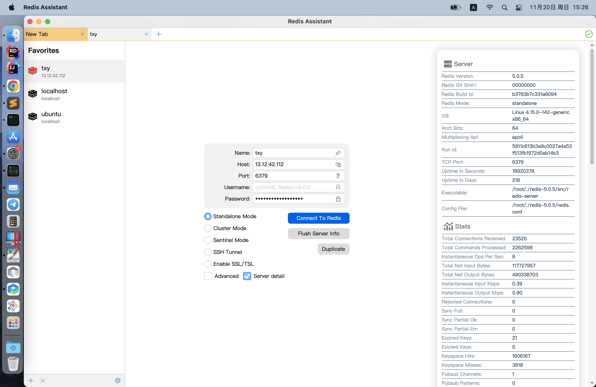
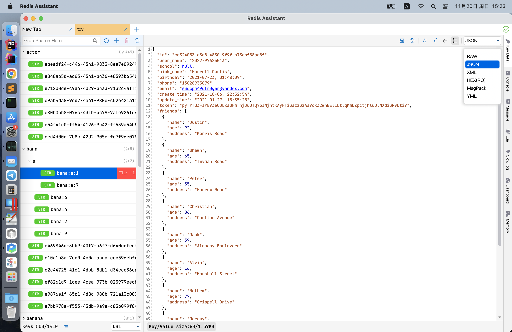
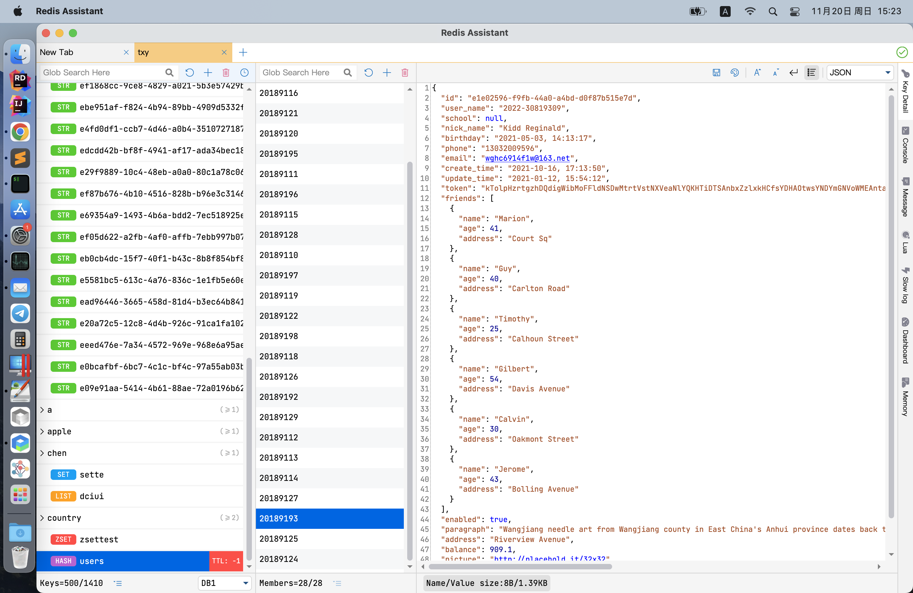
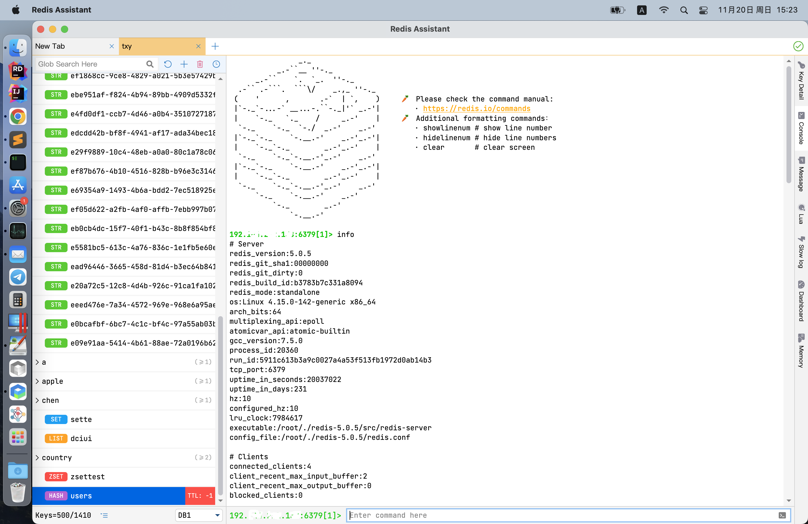
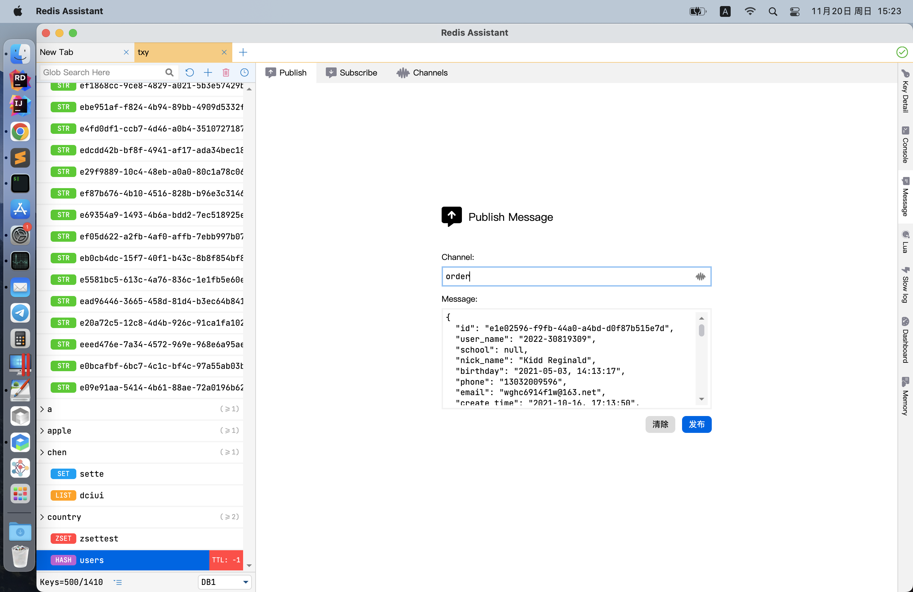
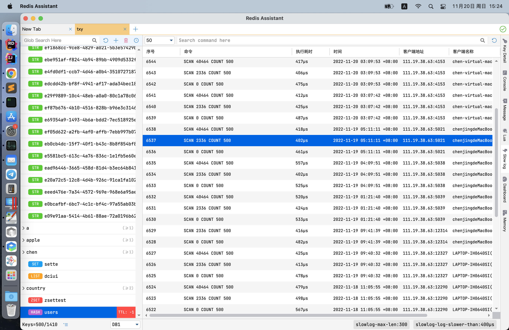
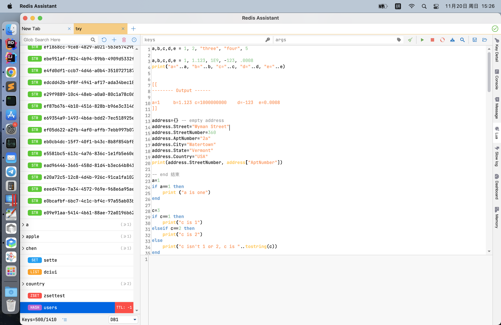

### Linux

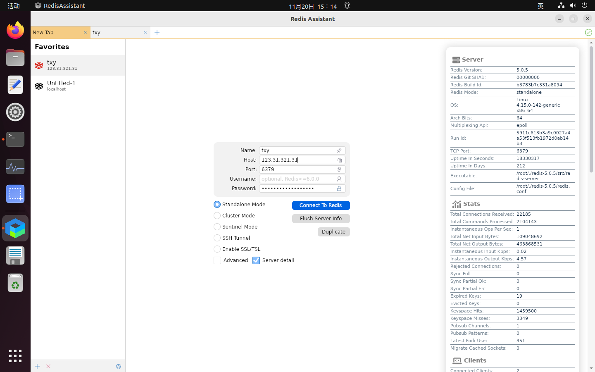
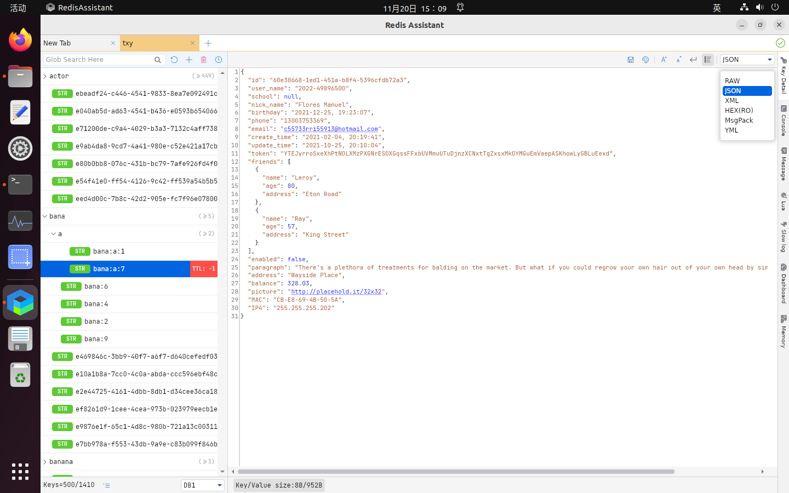
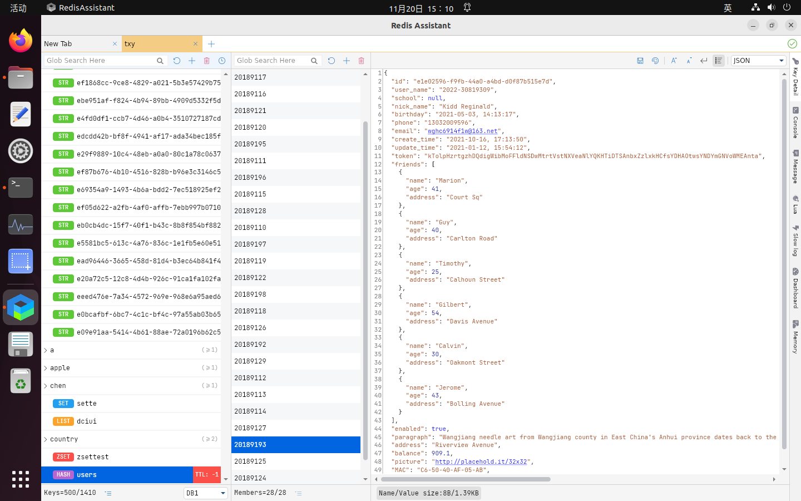
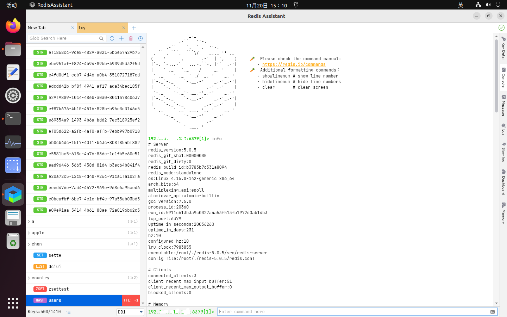
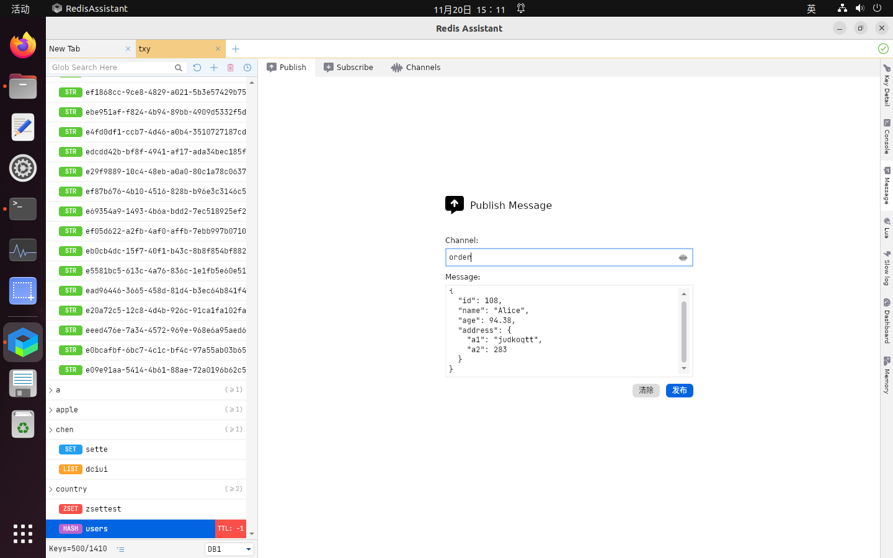
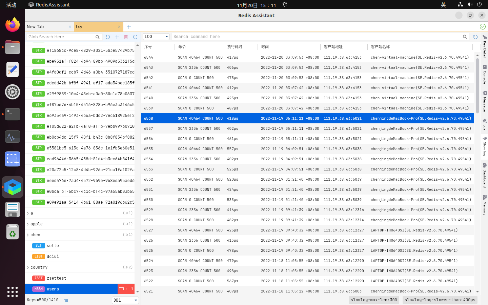
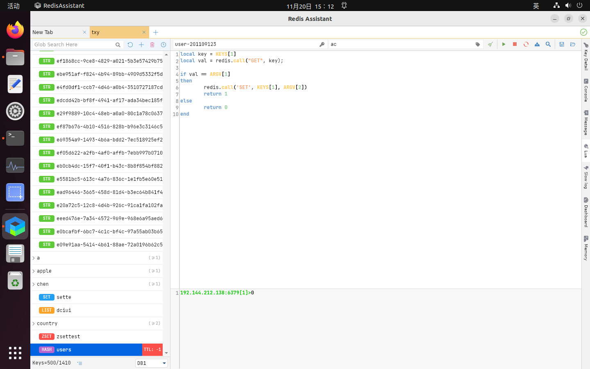
